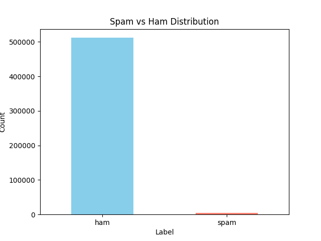

# 📧 Spam Classifier using Machine Learning

## 📌 Project Overview
This project builds a spam classifier using the **SMS Spam Collection dataset (Kaggle)** for training and applies the trained model to a large unlabeled dataset (~1.4 GB).  
The pipeline includes **data preprocessing, model training, prediction, evaluation, and visualization**.

---

## ⚙️ Tech Stack
- Python 3.x  
- Pandas, NumPy  
- scikit-learn (TF-IDF, Naive Bayes)  
- Matplotlib / Seaborn  
- Joblib (model persistence)

---

## 📂 Project Structure

---

## 🚀 Workflow
1. **Training (`train.py`)**  
   - Trains Naive Bayes classifier on Kaggle dataset  
   - Achieved **96.7% accuracy**

2. **Prediction (`predict.py`)**  
   - Applies trained model to large dataset  
   - Generates `spam_predictions.csv`

3. **Evaluation (`evaluate.py`)**  
   - Counts spam vs ham  
   - Results:  
     - Ham: 512,042  
     - Spam: 5,359  
     - Distribution: ~99% ham, ~1% spam

4. **Visualization (`visualize.py`)**  
   - Bar chart of spam vs ham distribution  

---

## 📊 Results
- **Training Accuracy:** 96.7%  
- **Large Dataset Predictions:**  
  - Ham: 512,042 (~98.96%)  
  - Spam: 5,359 (~1.03%)

---

## 📈 Future Improvements
- Try other models (Logistic Regression, SVM)  
- Handle class imbalance with oversampling/undersampling  
- Deploy as a Flask/Django API for real-time classification  

---

## 👩‍💻 Author
**Ayushi Verma**  
B.Tech in AI & ML, Ajay Kumar Garg Engineering College, Ghaziabad
